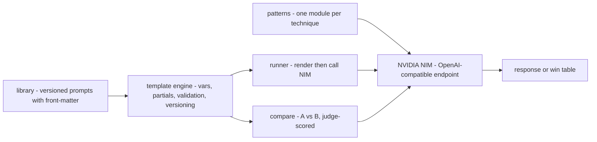

# prompt-engineering-lab

**A tested prompt-engineering library and template engine — treat prompts like code.** Versioned system prompts, one runnable module per technique, and A/B comparison on the free NVIDIA NIM tier.

[](LICENSE)
[](https://www.python.org/)
[](tests/)
[](https://build.nvidia.com)
[](.env.example)

## Why

Most prompts live as f-strings scattered through a codebase: no version history, no validation, no way to tell whether the "improved" prompt is actually better. This repo fixes that. A prompt is a **versioned folder** you can pin and diff. The **template engine** fails loudly when a variable is missing instead of shipping a half-rendered prompt. Each **technique** — chain-of-thought, self-consistency, reflexion, tree-of-thought and more — is a small, documented, runnable module, so you can read the prompt, run it on NIM, and see why it helps. And when you change a prompt, you can **A/B the two versions** over a set of inputs and get a judge-scored win table instead of a gut feeling.

Everything runs on the free NVIDIA NIM tier. The pure core — template engine, front-matter, versioning — has zero network dependencies and is covered by tests.

## Architecture



The template engine is the hub. Library prompts render through it; the runner sends the rendered prompt to NIM; compare renders two variants and asks a judge model which won. The technique modules are self-contained demonstrations that call NIM directly.

## Prompt-technique cheat-sheet

| Technique | When to use | Relative cost |
|---|---|---|
| `zero_shot` | Simple, well-specified tasks a strong model already knows | 1 call |
| `few_shot` | You need a specific format or edge-case behaviour examples pin down | 1 call, longer prompt |
| `chain_of_thought` | Multi-step reasoning, arithmetic, logic where showing work helps | 1 call, more output tokens |
| `self_consistency` | CoT tasks with a checkable answer; trade cost for accuracy | N calls, majority vote |
| `react_mini` | The model needs tools to act, not just answer | 1 call per step, bounded |
| `reflexion` | Quality-sensitive drafts that benefit from a self-critique pass | 3 calls |
| `tree_of_thought` | Search-like problems where partial ideas must be compared | breadth × depth calls |
| `least_to_most` | Hard problems that decompose into easier ordered sub-problems | 1 + one per sub-problem |
| `step_back` | Questions answered better after stating the general principle first | 2 calls |
| `structured_json` | You need machine-readable output downstream code can parse | 1 call + local validation |
| `rag_prompt` | Answers must be grounded in retrieved context and cite the source | 1 call, retrieval upstream |
| `guardrail_prompt` | Untrusted input; you need scope, safety, and refusal behaviour | 1 call + local screening |

Run any of them live: `python -m promptlab.patterns.chain_of_thought`. Print the table from the CLI: `python cli.py techniques`.

## Quickstart

```bash
git clone https://github.com/AleBrito124356/prompt-engineering-lab.git
cd prompt-engineering-lab

python -m venv .venv && source .venv/bin/activate   # Windows: .venv\Scripts\activate
pip install -e ".[dev]"                              # or: pip install -r requirements.txt

cp .env.example .env                                 # then edit .env
```

Get a **free** NIM API key: create an account at [build.nvidia.com](https://build.nvidia.com), open any model, click **Get API Key**. It starts with `nvapi-`. Put it in `.env`:

```
NVIDIA_API_KEY=nvapi-XXXXXXXXXXXXXXXXXXXXXXXX
```

The offline half of the toolkit — rendering, versioning, diffing, and every pattern's prompt-building logic — works without a key. Only actually *calling* a model needs one.

## Usage

Everything is available through `cli.py` (or the `promptlab` command after `pip install -e .`).

**List the prompt library:**

```bash
$ python cli.py list
coding-assistant    [v1,v2]  Help write, explain, and debug code with idiomatic, runnable examples.
sql-expert          [v1,v2]  Write and explain correct, efficient SQL for a given dialect.
json-responder      [v1,v2]  Always respond with valid JSON matching a caller-supplied schema.
...
```

**Render a prompt to text — no network, strict variable checking:**

```bash
$ python cli.py render sql-expert --var dialect=PostgreSQL
You are a SQL expert writing PostgreSQL.
...
# Missing a variable? It tells you instead of rendering a broken prompt:
$ python cli.py render sql-expert
error: missing variables: dialect
```

**Run a prompt on NIM** (renders as the system prompt, sends your user turn):

```bash
$ python cli.py run sql-expert --var dialect=PostgreSQL \
    --user "top 5 customers by revenue from orders(customer_id, amount)"
SELECT customer_id, SUM(amount) AS revenue
FROM orders
GROUP BY customer_id
ORDER BY revenue DESC
LIMIT 5;
```

**Diff two versions** of a prompt before you trust a change:

```bash
$ python cli.py diff coding-assistant --a v1 --b v2
--- coding-assistant@v1
+++ coding-assistant@v2
@@ ... @@
-Rules:
+Answer in this order:
+1. **Assumptions** -- if anything is ambiguous, state the assumptions...
```

**A/B compare** two prompt versions over a set of inputs, judge-scored:

```bash
$ python cli.py compare coding-assistant@v1 coding-assistant@v2 \
    --var language=Python --inputs examples/coding-questions.txt
# | input                            | winner              | why
--+----------------------------------+---------------------+---------------------------
1 | Write a function that returns…   | coding-assistant@v2 | states assumptions and…
2 | Debug this: my list comprehen…   | coding-assistant@v2 | catches the actual bug…
3 | How do I read a large CSV fil…   | tie                 | both stream correctly…
4 | Reverse the words in a senten…   | coding-assistant@v1 | shorter and equally corr…

coding-assistant@v1: 1   coding-assistant@v2: 2   ties: 1   ->  winner: coding-assistant@v2
```

**Run a technique demo directly:**

```bash
$ python -m promptlab.patterns.self_consistency
====================================================
Self-consistency (sample N, majority vote)
====================================================
Sampled answers: ['23', '23', '24', '23', '23']
Vote counts: {'23': 4, '24': 1}
Majority answer: 23
```

### As a library

```python
from promptlab import PromptLibrary, render, Template

# Render a versioned library prompt
lib = PromptLibrary("library")
system = lib.render("summarizer", {"length": "3 bullet points"}, version="v2")

# Or use the template engine on its own
Template("Hi {{ name }}{{#if vip}}, welcome back{{/if}}!").render({"name": "Ada", "vip": True})
# -> "Hi Ada, welcome back!"
```

## Template syntax

The engine is dependency-free and deliberately small. Interpolating a variable that is **absent** from the context raises `MissingVariableError` in strict mode (the default) — a renamed variable fails immediately instead of silently producing an empty prompt.

| Syntax | Meaning |
|---|---|
| `{{ name }}` / `{{ user.name }}` | Variable interpolation, dotted access |
| `{{! comment }}` | Comment, removed from output |
| `{{> partial }}` | Include a shared partial from `library/_partials/` |
| `{{#if flag}}…{{else}}…{{/if}}` | Conditional; a missing variable is falsy |
| `{{#unless flag}}…{{/unless}}` | Negated conditional |
| `{{#each items}}…{{ this }} / {{ field }}…{{/each}}` | Iterate a list; supports `{{else}}` when empty |

`find_variables(source)` returns the variables the outer context must supply (loop-local names are excluded); `missing_variables(source, context)` reports which are absent. Both power the strict check the CLI runs before rendering.

## Versioning stops prompt regressions

A prompt is a folder of version files plus a `meta.yaml`:

```
library/coding-assistant/
├── meta.yaml     # title, latest pointer, tags, changelog
├── v1.md         # front-matter (purpose, inputs, model_tips) + body
└── v2.md
```

Because each version is a plain file, you get the same safety net you have for code:

- **Pin** an exact version in production: `lib.render("coding-assistant", vars, version="v1")`. A later edit that adds `v3.md` cannot silently change what production sends.
- **Diff** two versions to review a change: `python cli.py diff coding-assistant --a v1 --b v2`.
- **Measure** the change before promoting it: `compare` gives you a win rate, not a vibe.

`meta.yaml`'s `latest:` field decides which version is the default; drop it and the highest-numbered file wins.

## The library

More than 20 ready-to-use system prompts, each with YAML front-matter (`purpose`, `inputs`, `model_tips`):

`coding-assistant` · `sql-expert` · `data-analyst` · `summarizer` · `classifier` · `extractor` · `translator` (ES/EN) · `rewriter` · `interviewer` · `socratic-tutor` · `red-teamer` · `json-responder` · `code-reviewer` · `commit-writer` · `regex-builder` · `test-writer` · `email-drafter` · `meeting-summarizer` · `product-namer` · `sentiment-analyst` · `api-designer` · `prompt-improver`

Shared clauses (a no-fabrication rule, a concision rule) live in `library/_partials/` and are pulled into prompts with `{{> no-fabrication }}`.

## Project structure

```
prompt-engineering-lab/
├── cli.py                     # entry point: list, show, render, run, compare, diff, techniques
├── src/promptlab/
│   ├── template.py            # the template engine (vars, partials, blocks, validation)
│   ├── frontmatter.py         # YAML front-matter parsing
│   ├── prompt.py              # Prompt + PromptLibrary: versioning and diffing
│   ├── client.py              # NVIDIA NIM client (OpenAI-compatible)
│   ├── runner.py              # render a library prompt and run it on NIM
│   ├── compare.py             # A/B two variants, judge-scored win table
│   ├── cli.py                 # argparse CLI implementation
│   └── patterns/              # one runnable module per technique
│       ├── zero_shot.py       few_shot.py            chain_of_thought.py
│       ├── self_consistency.py react_mini.py         reflexion.py
│       ├── tree_of_thought.py least_to_most.py       step_back.py
│       └── structured_json.py rag_prompt.py          guardrail_prompt.py
├── library/                   # 20+ versioned system prompts + _partials/
├── examples/                  # sample inputs for `compare`
├── tests/                     # pytest, no network required
├── requirements.txt · pyproject.toml · .env.example
```

## Tests

The pure core is fully tested and needs no API key or network:

```bash
pytest -q
```

Coverage spans the template engine (variable validation, includes, conditionals, loops, partial recursion), version resolution and diffing, front-matter loading, every pattern's prompt-building and parsing logic, and the comparison scoring and table rendering.

## Measure, don't vibe-check

The single most common prompt-engineering mistake is trusting a change because the one example you tried looked better. Don't. Use `compare` to A/B variants on a *set* of representative inputs, and treat the win table as a signal, not a verdict — LLM judges have biases, so keep a few human-checked cases too. When you want real regression testing, fixed metrics, and a proper eval harness rather than pairwise judging, reach for the sibling **[llm-eval-toolkit](https://github.com/AleBrito124356/llm-eval-toolkit)**. This repo gets you a fast, honest A/B; that one gets you a scoreboard you can gate a release on.

## Related projects

- **[nim-agent-lab](https://github.com/AleBrito124356/nim-agent-lab)** — 12 AI agent patterns in pure Python on free NVIDIA NIM; the natural next step once your prompts are solid.
- **[llm-eval-toolkit](https://github.com/AleBrito124356/llm-eval-toolkit)** — Prompt regression testing and an LLM evaluation harness for when A/B is not enough.
- **[rag-blueprints](https://github.com/AleBrito124356/rag-blueprints)** — 8 RAG architectures; where the retrieval behind `rag_prompt` actually lives.
- **[structured-extraction-agents](https://github.com/AleBrito124356/structured-extraction-agents)** — Messy documents to validated JSON with Pydantic, extending the `structured_json` pattern.

## License

MIT © 2026 Alejandro Brito. See [LICENSE](LICENSE).
