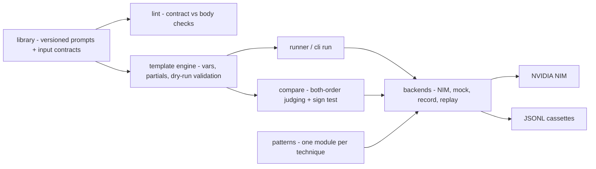

# prompt-engineering-lab

**A tested prompt-engineering library and template engine: treat prompts like code.** Versioned system prompts with typed input contracts and a `lint` gate, one runnable module per technique, and A/B comparison with position-bias control and a significance test. It runs on the free NVIDIA NIM tier, and all of it also runs offline.

[](LICENSE)
[](https://www.python.org/)
[](tests/)
[](https://build.nvidia.com)
[](.env.example)

## Why

Most prompts live as f-strings scattered through a codebase: no version history, no validation, and no way to tell whether the "improved" prompt is actually better. This repo fixes that.

- A prompt is a **versioned folder** you can pin and diff. Its front-matter declares an **input contract** (required inputs, defaults, allowed values), and `promptlab lint` fails CI when the body drifts from that contract.
- The **template engine** fails loudly when a variable is missing, even one used inside a loop, instead of shipping a half-rendered prompt.
- Each **technique** (chain-of-thought, self-consistency, ReAct, reflexion, tree-of-thought and seven more) is a small, documented, runnable module. `--offline` runs the full loop on scripted model output, with no key needed.
- To A/B two prompt versions, **`compare`** judges every pair in both orders to cancel judge position bias, then reports a win rate with a confidence interval and a sign-test p-value. It names a winner only when the difference is significant.

See [CHANGELOG.md](CHANGELOG.md) for what changed in 0.2.0.

## Architecture



The template engine is the hub. Library prompts render through it, with defaults from their contract filled in. The runner sends the rendered prompt to a model, and compare renders two variants and asks a judge which one won. Every model call goes through a **backend** that shares one interface (`chat` / `complete` / `sample`). That backend can be live NIM, the scripted offline mock, a recorder that writes calls to a JSONL cassette, or a replayer that serves them back.

## Prompt-technique cheat-sheet

| Technique | When to use | Relative cost |
|---|---|---|
| `zero_shot` | Simple, well-specified tasks a strong model already knows | 1 call |
| `few_shot` | You need a specific format or edge-case behaviour examples pin down | 1 call, longer prompt |
| `chain_of_thought` | Multi-step reasoning, arithmetic, logic where showing work helps | 1 call, more output tokens |
| `self_consistency` | CoT tasks with a checkable answer; trade cost for accuracy | N calls, majority vote |
| `react_mini` | The model needs tools to act, not just answer | 1 call per step, bounded |
| `reflexion` | Quality-sensitive drafts that benefit from a self-critique pass | 3 calls |
| `tree_of_thought` | Search-like problems where partial ideas must be compared | breadth × depth calls |
| `least_to_most` | Hard problems that decompose into easier ordered sub-problems | 1 + one per sub-problem |
| `step_back` | Questions answered better after stating the general principle first | 2 calls |
| `structured_json` | You need machine-readable output downstream code can parse | 1 call + local validation |
| `rag_prompt` | Answers must be grounded in retrieved context and cite the source | 1 call + local citation check |
| `guardrail_prompt` | Untrusted input; you need scope, safety, and refusal behaviour | 1 call + input screen + leak check |

Run any of them live with `python -m promptlab.patterns.chain_of_thought`, or offline with `python -m promptlab.patterns.chain_of_thought --offline`. `python cli.py techniques` prints the table.

## Quickstart

```bash
git clone https://github.com/AleBrito124356/prompt-engineering-lab.git
cd prompt-engineering-lab

python -m venv .venv && source .venv/bin/activate   # Windows: .venv\Scripts\activate
pip install -e ".[dev]"                              # or: pip install -r requirements.txt

# No key needed to see everything work:
python -m promptlab.patterns.react_mini --offline
python cli.py compare coding-assistant@v1 coding-assistant@v2 \
    --var language=Python --inputs examples/coding-questions.txt --offline
```

To call a real model, get a **free** NIM API key: create an account at [build.nvidia.com](https://build.nvidia.com), open any model and click **Get API Key**. The key starts with `nvapi-`. Put it in `.env` (copy `.env.example`):

```
NVIDIA_API_KEY=nvapi-XXXXXXXXXXXXXXXXXXXXXXXX
```

A regular `pip install .` (or installing the built wheel) also works: the prompt library ships inside the package as `promptlab/library/`.

## Usage

Everything is available through `cli.py` (or the `promptlab` command once installed).

**List the prompt library:**

```bash
$ python cli.py list
api-designer        [v1]     Design clean, consistent REST APIs from a feature description.
classifier          [v1]     Assign each input exactly one label from a fixed set.
code-reviewer       [v1]     Review a diff or snippet for correctness, security, and clarity.
coding-assistant    [v1,v2]  Help write, explain, and debug code with idiomatic, runnable examples and an explicit review pass.
...
```

**Show a prompt, including its input contract:**

```bash
$ python cli.py show translator
# Translator (ES/EN)  (v1)
versions : v1
purpose  : Translate between Spanish and English while preserving tone, register, and meaning.
...
inputs   :
  - target_language (required; one of: Spanish, English)  Either Spanish or English.
  - register (optional)  Optional register, e.g. "formal", "neutral", "casual". Omit it to match the source.
```

**Render a prompt to text.** This needs no network and checks variables strictly:

```bash
$ python cli.py render sql-expert --var dialect=PostgreSQL
You are a SQL expert writing PostgreSQL.
...
# A missing variable or an invalid value gives a one-line error and exit code 2:
$ python cli.py render sql-expert
error: sql-expert@v2: missing variables: dialect (pass --var key=value or --no-strict)
$ python cli.py render translator --var target_language=Klingon
error: translator@v1: invalid value 'Klingon' for input 'target_language'; expected one of: Spanish, English
# Optional inputs really are optional:
$ python cli.py render interviewer --var role="backend engineer"
You are interviewing a candidate for a backend engineer position. No seniority was given, ...
```

**Run a prompt.** The rendered prompt becomes the system message and `--user` is the user turn:

```bash
$ python cli.py run sql-expert --var dialect=PostgreSQL \
    --user "top 5 customers by revenue from orders(customer_id, amount)"
# live NIM answer

$ python cli.py run sql-expert --var dialect=PostgreSQL --user "top 5 customers" --offline
note: offline mode -- responses come from promptlab's scripted mock model, not a live LLM.
[offline mock response -- scripted, not a live model]
Request: top 5 customers
Role from the system prompt: You are a SQL expert writing PostgreSQL.
Checklist taken from the system prompt:
- Produce syntactically correct PostgreSQL. ...
```

Without a key, `run` prints `error: NVIDIA_API_KEY is not set.`, a two-minute signup walkthrough and a pointer to `--offline`, then exits with code 2. It never prints a traceback.

**Record once, replay forever.** Record a live run to a JSONL cassette, then replay it offline (in CI, in a demo, or on a plane):

```bash
python cli.py run sql-expert --var dialect=PostgreSQL --user "top 5 customers" --record runs/sql.jsonl
python cli.py run sql-expert --var dialect=PostgreSQL --user "top 5 customers" --replay runs/sql.jsonl
```

Each cassette entry is keyed by a hash of model, messages and sampling parameters. If you change the prompt, replay fails with `error: no recorded response ...` and a unified diff against the closest recorded request, so a prompt change can never be answered by a stale recording. `PROMPTLAB_BACKEND=mock | record:FILE | replay:FILE` sets the same thing for every command, the runner and the technique demos.

**Diff two versions** of a prompt before you trust a change:

```bash
$ python cli.py diff coding-assistant --a v1 --b v2
--- coding-assistant@v1
+++ coding-assistant@v2
@@ ... @@
-Rules:
+Answer in this order:
+1. **Assumptions** -- if anything is ambiguous, state the assumptions...
```

**A/B compare** two prompt versions over a set of inputs (see [Measure, don't vibe-check](#measure-dont-vibe-check) for how to read the output):

```bash
$ python cli.py compare coding-assistant@v1 coding-assistant@v2 \
    --var language=Python --inputs examples/coding-questions.txt --out report.md --out report.json
```

**Lint the library** against its contracts (see [Prompt contracts and lint](#prompt-contracts-and-lint)):

```bash
$ python cli.py lint
ok: 22 prompt(s) checked, 0 error(s), 0 warning(s)
```

**Run a technique demo.** `--offline` serves scripted model output while the technique code runs for real:

```bash
$ python -m promptlab.patterns.self_consistency --offline
========================================================================
Self-consistency (sample N, majority vote)
========================================================================
[offline] Scripted responses, not a live model: the technique code (parsing, tool calls, voting, search, validation) runs for real on canned model output.

Sampled answers: ['23', '23', '23 apples', '24', '23']
Vote counts: {'23': 4, '24': 1}
Majority answer: 23

[offline] 5 scripted model call(s) served.
```

The five scripted samples format the answer differently (`23`, `**23**`, `23 apples`, `23.`) and one of them makes an arithmetic slip. The vote is only right because answer normalisation merges the formats. In the ReAct demo the calculator results are real and the final turn quotes them back. The tree-of-thought demo prints every scored candidate and the beam it kept. Every demo also accepts `--record FILE`, `--replay FILE` and `--model NAME`.

Exit codes for the CLI: `0` success, `1` lint findings or a failed model call (network, auth, cassette miss), `2` usage or configuration errors (unknown prompt, missing variable, invalid input value, missing API key, bad `--vars-json`, missing or empty inputs file).

### As a library

```python
from promptlab import BUNDLED_LIBRARY, PromptLibrary, Template
from promptlab.backends import ScriptedClient, make_client
from promptlab.patterns import self_consistency

# Render a versioned library prompt (defaults from its contract are filled in)
lib = PromptLibrary(BUNDLED_LIBRARY)
system = lib.render("summarizer", {"length": "3 bullet points"}, version="v2")

# The template engine on its own
Template("Hi {{ name }}{{#if vip}}, welcome back{{/if}}!").render({"name": "Ada", "vip": True})
# -> "Hi Ada, welcome back!"

# Any technique against any backend: a fake, the offline mock, live NIM, or a cassette
fake = ScriptedClient(["Final answer: 7", "Final answer: **7**", "Final answer: 9"])
winner, answers, votes = self_consistency.run("...", n=3, client=fake)   # winner == "7"
mock = make_client("mock")        # also: make_client() for NIM, make_client("replay:runs/sql.jsonl")
```

## Prompt contracts and lint

Each version file starts with YAML front-matter. The `inputs` list is the prompt's contract:

```yaml
---
purpose: Run a focused mock interview, one question at a time, with feedback; seniority is optional.
inputs:
  - name: role                    # required (the default)
    description: The role being interviewed for.
  - name: level
    description: Optional seniority, e.g. "junior", "senior".
    required: false               # omitted -> rendered as ""
  - name: target_language
    enum: [Spanish, English]      # anything else is rejected
  - name: style
    default: pragmatic REST       # a default makes the input optional
model_tips: Temperature 0.6.
---
```

`Prompt.render` (and therefore `render`, `run` and `compare`) fills in defaults and rejects values outside an `enum`. In strict mode it also refuses to render when a required input is missing. A malformed contract raises `ContractError`: unknown keys (a typo such as `requierd` is caught), duplicate names, `required: true` combined with a `default`, or a default outside its `enum`.

`promptlab lint [NAME ...] [--format text|json] [--strict]` checks every prompt and version:

| Check | Severity | What it catches |
|---|---|---|
| `syntax` | error | Template or partial does not parse |
| `unknown-partial` | error | `{{> name }}` without `_partials/name.md` |
| `undeclared-input` | error | Body uses a variable the contract does not declare |
| `unused-input` | error | Contract declares an input the body never uses |
| `unguarded-optional` | error | Optional input with no default interpolated outside `{{#if name}}`, which leaves a hole like "a  backend engineer" |
| `invalid-inputs` | error | Malformed contract (see above) |
| `invalid-front-matter` / `invalid-meta` | error | YAML that does not parse |
| `missing-purpose` | error | No `purpose`, which is what `list` shows |
| `bad-latest` | error | `meta.yaml` pins `latest` to a version that does not exist |
| `render-failed` | error | A strict render with placeholder inputs raises |
| `optional-mismatch` | warning | Description says "optional" but the contract makes the input required |
| `outer-var-in-loop` | warning | A declared input used inside `{{#each}}`, where an item key of the same name would shadow it |
| `missing-changelog` | warning | A version without a `meta.yaml` changelog entry, or the reverse |
| `not-a-prompt` | warning | A library folder with no `v<N>.md` |

It exits `1` on errors (and on warnings with `--strict`), so it can gate CI. Here is a real run on a copy of the library with two typical mistakes, a renamed variable and a removed `#if` guard:

```bash
$ python cli.py --library /tmp/lib lint sql-expert interviewer
sql-expert@v2   error    undeclared-input    the body uses {{ sql_dialect }} but 'inputs' does not declare 'sql_dialect'
interviewer@v2  error    unguarded-optional  optional input 'level' is interpolated outside an {{#if level}} guard, so omitting it leaves an empty hole in the prompt; guard it or give it a non-empty default

failed: 2 prompt(s) checked, 2 error(s), 0 warning(s)
```

Before 0.2.0, the shipped library itself had this drift. `interviewer`, `summarizer`, `translator` and `api-designer` described an input as "optional" but required it, and `lint --strict` flagged exactly those four. They are fixed. `interviewer` got a `v2`, because its body changed.

## Measure, don't vibe-check

The single most common prompt-engineering mistake is trusting a change because the one example you tried looked better. `compare` runs both variants over a *set* of inputs and asks a judge model to pick the better answer for each input. Two safeguards keep that verdict honest.

**Position-bias control.** LLM judges tend to prefer whichever answer they see first (or second). By default each pair is judged **twice**, once with A shown first and once with B shown first. A pair counts as a win only when both orders agree. When they disagree the pair is a tie, and the table's `orders` column (`A/A`, `A/B`, ...) and the **position-bias rate** show it. A judge that always says "Winner: 1" produces 100% position bias and no winner. The 0.1 version declared a winner in that case, and which variant won depended on the random seed. `--single-order` restores one-shot judging if you need the speed.

**Statistics, not a raw count.** Ties are excluded, then `compare` reports the win rate with a Wilson confidence interval and a two-sided exact **sign test**. The verdict names a variant only when `p < --alpha` (default 0.05). Otherwise it says *no significant difference*, and it tells you when you have too few decisive inputs for any split to be significant: at alpha 0.05 even a 5-0 sweep has p = 0.0625, so you need at least 6. Here is the offline run from the quickstart:

```
# | input                            | winner              | orders | why
--+----------------------------------+---------------------+--------+---------------------------------------------
1 | Write a function that returns... | coding-assistant@v1 | A/A    | Offline heuristic judge (not an LLM): Res...
2 | Debug this: my list comprehen... | coding-assistant@v1 | A/A    | Offline heuristic judge (not an LLM): Res...
3 | How do I read a large CSV fil... | coding-assistant@v1 | A/A    | Offline heuristic judge (not an LLM): Res...
4 | Reverse the words in a senten... | coding-assistant@v1 | A/A    | Offline heuristic judge (not an LLM): Res...

coding-assistant@v1: 4   coding-assistant@v2: 0   ties: 0   (4 inputs, 4 decisive)
coding-assistant@v2 win rate (ties excluded): 0%  [95% CI 0%-49%]   sign test p = 0.125
judge consistency: 4/4 pairs agreed across both orders; position-bias rate 0%
->  winner: none -- no significant difference at alpha = 0.05 (with 4 decisive input(s) no split can be significant; need at least 6)
```

The offline judge is a transparent keyword-and-structure heuristic, not an LLM, so read the table for its shape rather than for which prompt is better. A live run has the same shape, and the lesson applies to it too: a 4-0 sweep over four inputs is not evidence.

Other options:

- `--judge-model` uses a different model as the judge, which avoids self-preference.
- `--criteria "..."` tells the judge what to weigh.
- `--repeats N` samples each variant N times per input. The input's winner is the majority, so the sign test still counts independent inputs.
- `--out report.json` saves every response, both per-order judge rationales, the configuration and the statistics. It reloads with `promptlab.compare.load_report`.
- `--out report.md` saves a readable audit trail of the same data.
- Comparing a prompt with itself (`compare sql-expert sql-expert ...`) is a useful sanity check of a judge. It should show no significant difference.

Treat the verdict as a signal and keep a few human-checked cases too. For fixed metrics and release gating rather than pairwise judging, reach for the sibling **[llm-eval-toolkit](https://github.com/AleBrito124356/llm-eval-toolkit)**.

## Template syntax

The engine is dependency-free and deliberately small. Interpolating a variable that is **absent** from the context raises `MissingVariableError` in strict mode (the default), so a renamed variable fails immediately instead of silently producing an empty prompt.

| Syntax | Meaning |
|---|---|
| `{{ name }}` / `{{ user.name }}` | Variable interpolation, dotted access |
| `{{! comment }}` | Comment, removed from output |
| `{{> partial }}` | Include a shared partial from the library's `_partials/` |
| `{{#if flag}}…{{else}}…{{/if}}` | Conditional; a missing variable is falsy |
| `{{#unless flag}}…{{/unless}}` | Negated conditional |
| `{{#each items}}…{{ this }} / {{ field }}…{{/each}}` | Iterate a list; supports `{{else}}` when empty |

`find_variables(source)` returns the variables the outer context must supply. Loop-local names are excluded, since static analysis cannot know them. `missing_variables(source, context)` combines that static check with a **dry run of the real render**, so it also reports an outer variable used inside `{{#each}}` (for example `{{#each rules}}{{ prefix }}{{/each}}` over a list of strings) and a dotted path whose leaf is missing (`user.email`). The CLI runs this check before every render. `variable_references(source)` returns every reference with its enclosing loops and `#if` guards, and `lint` is built on it.

## Versioning stops prompt regressions

A prompt is a folder of version files plus a `meta.yaml`:

```
src/promptlab/library/coding-assistant/
├── meta.yaml     # title, latest pointer, tags, changelog
├── v1.md         # front-matter (purpose, inputs contract, model_tips) + body
└── v2.md
```

Because each version is a plain file, you get the same safety net you have for code:

- **Pin** an exact version in production: `lib.render("coding-assistant", vars, version="v1")`. A later edit that adds `v3.md` cannot silently change what production sends.
- **Diff** two versions to review a change: `python cli.py diff coding-assistant --a v1 --b v2`.
- **Lint** the contract: `python cli.py lint coding-assistant`.
- **Measure** the change before promoting it: `compare` gives you a win rate with a confidence interval and a p-value.

`meta.yaml`'s `latest:` field decides which version is the default. If you drop it, the highest-numbered file wins. To point every command at a different library folder, use `--library PATH` or `PROMPTLAB_LIBRARY=PATH`.

## The library

22 ready-to-use system prompts, each with YAML front-matter (`purpose`, an `inputs` contract, `model_tips`). All of them pass `lint --strict`:

`coding-assistant` · `sql-expert` · `data-analyst` · `summarizer` · `classifier` · `extractor` · `translator` (ES/EN) · `rewriter` · `interviewer` · `socratic-tutor` · `red-teamer` · `json-responder` · `code-reviewer` · `commit-writer` · `regex-builder` · `test-writer` · `email-drafter` · `meeting-summarizer` · `product-namer` · `sentiment-analyst` · `api-designer` · `prompt-improver`

Shared clauses (a no-fabrication rule, a concision rule) live in `_partials/` and are pulled into prompts with `{{> no-fabrication }}`.

## Project structure

```
prompt-engineering-lab/
├── cli.py                     # entry point: list, show, render, run, compare, diff, lint, techniques
├── src/promptlab/
│   ├── template.py            # template engine (vars, partials, blocks, dry-run validation, references)
│   ├── frontmatter.py         # YAML front-matter parsing
│   ├── prompt.py              # Prompt + PromptLibrary: versioning, diffing, input contracts
│   ├── lint.py                # promptlab lint: contract-vs-body checks
│   ├── client.py              # ChatClient interface + NVIDIA NIM client
│   ├── backends.py            # ScriptedClient, RecordingClient, ReplayClient, mock model, make_client
│   ├── runner.py              # render a library prompt and run it on any backend
│   ├── compare.py             # A/B: both-order judging, sign test, Wilson CI, JSON/Markdown reports
│   ├── cli.py                 # argparse CLI implementation
│   ├── library/               # 22 versioned system prompts + _partials/ (shipped in the wheel)
│   └── patterns/              # one runnable module per technique, each with --offline
│       ├── zero_shot.py       few_shot.py            chain_of_thought.py
│       ├── self_consistency.py react_mini.py         reflexion.py
│       ├── tree_of_thought.py least_to_most.py       step_back.py
│       └── structured_json.py rag_prompt.py          guardrail_prompt.py
├── examples/                  # sample inputs for `compare`
├── tests/                     # pytest, no network required
├── CHANGELOG.md · requirements.txt · pyproject.toml · .env.example
```

## Tests

```bash
pytest -q                                   # 359 tests, no API key, no network
pytest -q --cov=promptlab                   # ~96% line coverage
```

The suite needs no key and never touches the network. Model calls go to `ScriptedClient` or `ReplayClient`. It covers:

- the template engine, including the dry-run check for loop variables
- versioning, diffing and front-matter
- input contracts and every `lint` check, on a deliberately broken fixture library
- every CLI command and error path, including real subprocesses that must exit 2 without a traceback
- every technique's full `run()` loop: ReAct tool calls and step budget, the tree-of-thought beam, self-consistency voting, least-to-most chaining, reflexion's three passes, JSON extraction, citation checks, guardrail blocking and leak withholding
- all 12 demos run as `python -m ... --offline`
- record/replay round trips and cassette misses
- the compare statistics, checked against hand-computed binomials and known Wilson intervals
- the packaging globs

`tests/test_regressions.py` pins every input from the 0.1.0 audit that produced a wrong result, a hang or a traceback.

## Related projects

- **[nim-agent-lab](https://github.com/AleBrito124356/nim-agent-lab)**: 12 AI agent patterns in pure Python on free NVIDIA NIM, the natural next step once your prompts are solid.
- **[llm-eval-toolkit](https://github.com/AleBrito124356/llm-eval-toolkit)**: prompt regression testing and an LLM evaluation harness, for when A/B is not enough.
- **[rag-blueprints](https://github.com/AleBrito124356/rag-blueprints)**: 8 RAG architectures, where the retrieval behind `rag_prompt` actually lives.
- **[structured-extraction-agents](https://github.com/AleBrito124356/structured-extraction-agents)**: messy documents to validated JSON with Pydantic, extending the `structured_json` pattern.

## License

MIT © 2026 Alejandro Brito. See [LICENSE](LICENSE).
